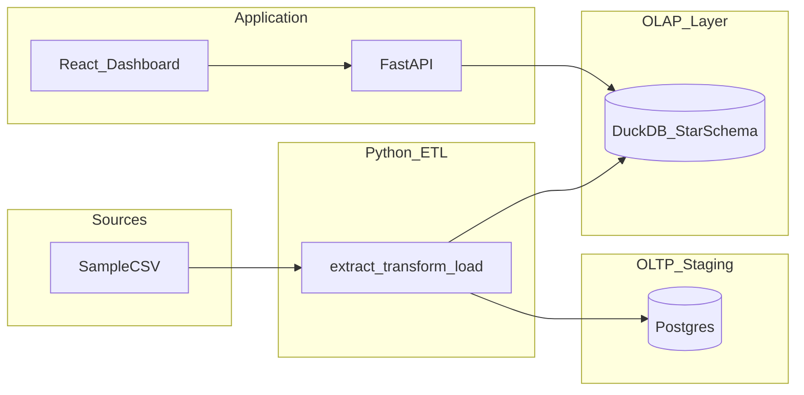

# OLAP Analytics Demo

End-to-end retail analytics project for your resume: **Postgres staging → Python ETL → DuckDB star schema → FastAPI OLAP API → React dashboard**, deployable entirely on free tiers.

## Architecture



**Problem statement:** Operational data lives in Postgres; analytics are served from a denormalized OLAP star schema in DuckDB for fast slice-and-dice queries.

| Layer | Tables |
|-------|--------|
| Staging (Postgres) | `raw_orders`, `raw_products`, `raw_stores` |
| OLAP (DuckDB) | `fact_sales`, `dim_date`, `dim_product`, `dim_store`, `dim_customer` |

## Tech stack

Python · FastAPI · DuckDB · Postgres · React · Vite · Recharts · Docker · GitHub Actions

## Local setup

### 1. Prerequisites

- Python 3.11+
- Node.js 20+
- Docker (for local Postgres)

### 2. Configure environment

```bash
cp .env.example .env
```

### 3. Start Postgres

```bash
docker compose up -d
```

### 4. Run the ETL pipeline

```bash
pip install -r etl/requirements.txt
python scripts/run_pipeline.py
```

This generates ~60k synthetic orders, loads Postgres staging tables, and builds `data/warehouse.duckdb`.

If Postgres is not running, the pipeline automatically falls back to building the warehouse directly from CSV files.

### 5. Start the API

```bash
pip install -r api/requirements.txt
uvicorn api.main:app --reload
```

OpenAPI docs: http://localhost:8000/docs

### 6. Start the dashboard

```bash
cd web
npm install
npm run dev
```

Dashboard: http://localhost:5173

## API endpoints

| Endpoint | Description |
|----------|-------------|
| `GET /health` | Health check |
| `GET /api/metrics/summary` | KPIs: revenue, orders, AOV |
| `GET /api/metrics/revenue-trend?grain=month` | Time-series aggregation |
| `GET /api/metrics/by-category` | Revenue by product category |
| `GET /api/cube?dimensions=region,category&measure=revenue` | Slice & dice |
| `GET /api/cube/drill?dimension=date&level=year` | Drill-down by time |

## Free hosting

| Component | Service | Notes |
|-----------|---------|-------|
| Staging DB | [Neon](https://neon.tech) | Free Postgres tier |
| OLAP | DuckDB file | Bundled with API, rebuilt on deploy |
| API | [Render](https://render.com) | See `render.yaml` |
| Frontend | [Vercel](https://vercel.com) | Deploy `web/` directory |

### Deploy steps

1. **Neon** — Create a project, copy the connection string.
2. **Render** — New Web Service from repo, use `render.yaml`. Set env vars:
   - `DATABASE_URL` = Neon connection string
   - `CORS_ORIGINS` = your Vercel URL (e.g. `https://your-app.vercel.app`)
3. **Vercel** — Import repo, set root directory to `web`, add env var:
   - `VITE_API_URL` = your Render API URL
4. Update this README with your live demo URL.

> **Note:** Render free tier sleeps after inactivity (~30s cold start on first request).

## Resume bullets

Copy-paste examples:

- Built an end-to-end OLAP pipeline: Python ETL from Postgres staging to DuckDB star schema, with slice/dice REST API and React dashboard.
- Implemented drill-down analytics (time, region, product) using DuckDB aggregations and a pivot-style cube endpoint.
- Deployed full stack on Neon, Render, and Vercel free tiers with GitHub Actions CI.

## Future enhancements

- dbt transform layer
- Airflow orchestration
- Additional cube dimensions and ROLLUP/CUBE SQL
- Auth and row-level security

## Project structure

```
helloworld/
├── api/              # FastAPI OLAP endpoints
├── etl/              # Data generation + ETL scripts
├── web/              # React dashboard
├── data/raw/         # Synthetic CSV seeds
├── scripts/          # Pipeline runner
├── docker-compose.yml
└── render.yaml
```
